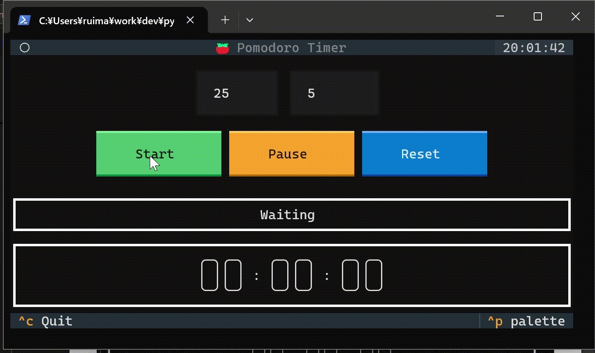
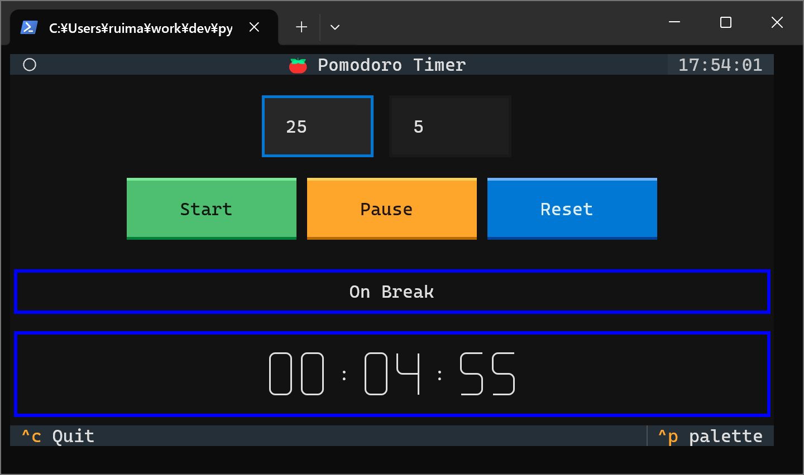
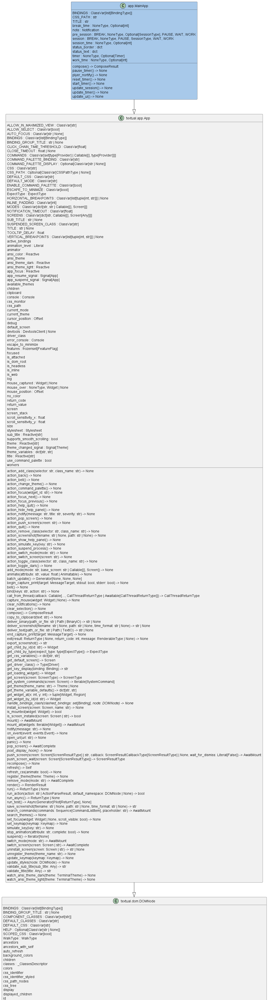

<!-- ============================================================
  Project Image
 ============================================================ -->
<div align=center>
  
</div>

<!-- ============================================================
  Overview
 ============================================================ -->
# :book:Overview

[](./README.md)
[](./README_JA.md)
[](./LICENSE)
[](https://mypy-lang.org/)
[](https://github.com/astral-sh/ruff)
[](https://github.com/astral-sh/uv)

[](https://github.com/python)
[](https://github.com/sphinx-doc/sphinx)
[](https://github.com/pytest-dev/pytest)
[](https://github.com/pydantic/pydantic)

This is a pomodoro timer app by TUI using [Textual].

We use [Plyer] to notify you when work or break time is over.

[Textual]: https://github.com/textualize/textual/
[Plyer]: https://github.com/kivy/plyer

<!-- ============================================================
  Features
 ============================================================ -->
## :desktop_computer:Features



|item                                          |feature                               |
| ---                                          | ---                                  |
|Work time input field (left side of screen)   |Set the working time. (unit: minutes) |
|Break time input field (right side of screen) |Set break time. (unit: minutes)       |
|Start button                                  |Start the timer.                      |
|Pause button                                  |Pause the timer.                      |
|Reset button                                  |Reset the timer.                      |
|Status display field                          |Shows the status (see below).         |
|Time display field                            |Show time.                            |

### Status

<table>
  <tr>
    <th>Wait status</th>
    <th>Work status</th>
  </tr>
  <tr>
    <td>
      
    </td>
    <td>
      
    </td>
  </tr>
</table>
<table>
  <tr>
    <th>Bleak status</th>
    <th>Pause status</th>
  </tr>
  <tr>
    <td>
      
    </td>
    <td>
      
    </td>
  </tr>
</table>

<!-- ============================================================
  Usage
 ============================================================ -->
## :keyboard:Usage

### Install

```bash
git clone https://github.com/r-dev95/textual-pomodoro-timer-app.git
```

### Build virtual environment

You need to install `uv`.

If you don't have a python development environment yet, see [here](https://github.com/r-dev95/env-python).

```bash
cd textual-pomodoro-timer-app/
uv sync
```

### Run

```bash
cd src
uv run python app.py
```

- Set work and break times.
- Press the start button to start the work status.

  When the working time is over, the status changes to Break.

- If you want to temporarily stop the timer, press the pause button.
- If you want to reset the timer, press the reset button.
- If you want to quit the app, press `Ctrl+q` or `Ctrl+c`.

<!-- ============================================================
  Structure
 ============================================================ -->
## :bookmark_tabs:Structure

<div align=center>
  
</div>

<!-- ============================================================
  License
 ============================================================ -->
## :key:License

This repository is licensed under the [MIT License](LICENSE).
