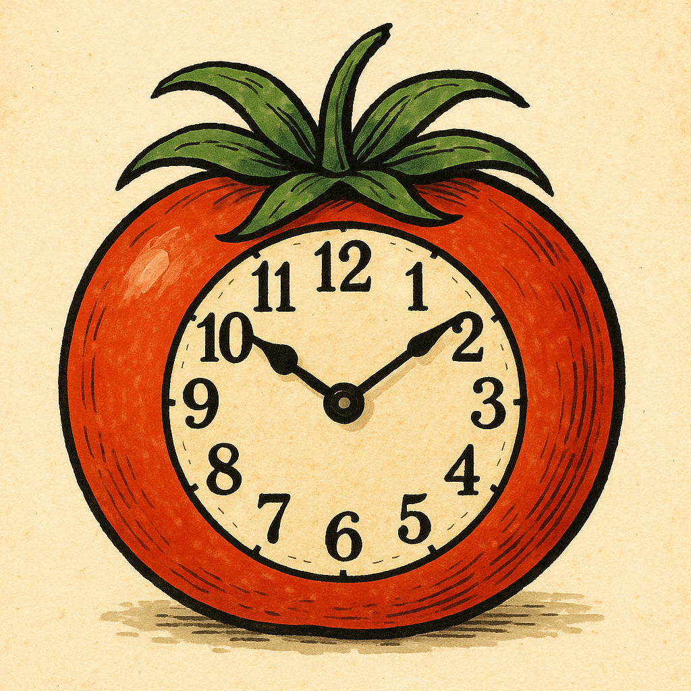
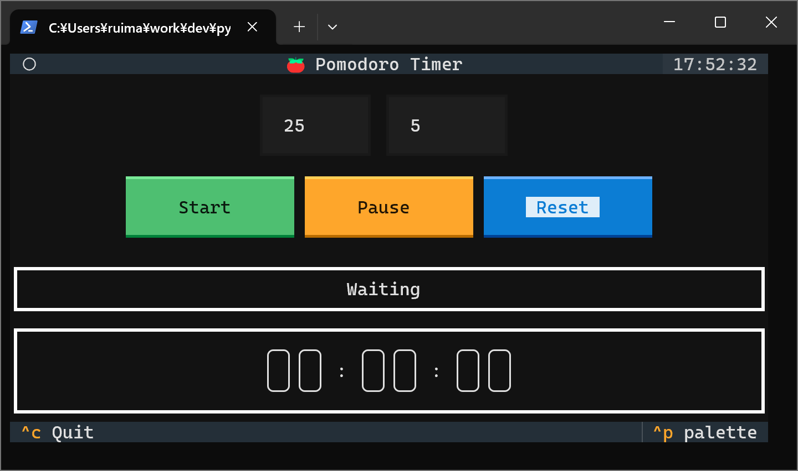
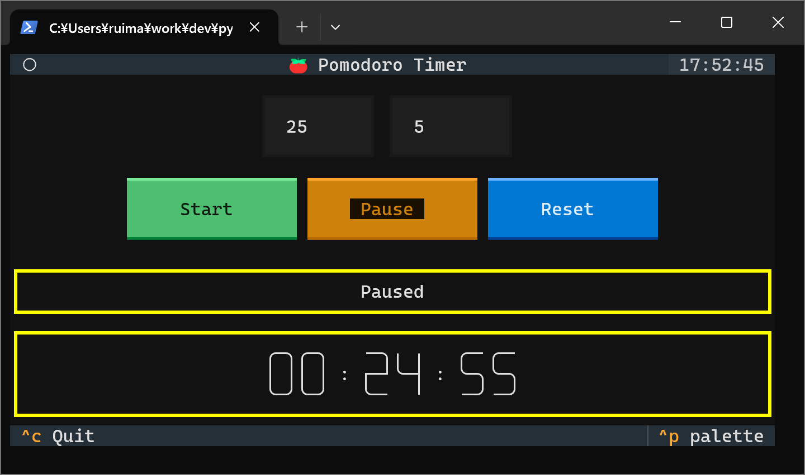

<!--
    README
 -->

 <div align='center'>
  
</div>

# :tomato:Textual Pomodoro Timer App

[](./README.md)
[](./README_JA.md)
[](./LICENSE)
[](https://mypy-lang.org/)

[](https://github.com/python)
[](https://github.com/astral-sh/uv)
[](https://github.com/astral-sh/ruff)
<!-- [](https://github.com/sphinx-doc/sphinx) -->
<!-- [](https://github.com/pytest-dev/pytest) -->

[Textual]を用いたTUIのポモドーロタイマーアプリです。

作業もしくは休憩時間が終了した際の通知は,
[Plyer]を使用しています。

[Textual]: https://github.com/textualize/textual/
[Plyer]: https://github.com/kivy/plyer

## :rocket:Getting started

### githubからインストール

```bash
git clone https://github.com/r-dev95/textual-pomodoro-timer-app.git
```

### 仮想環境の構築

`uv`がインストールされていることが前提です。

pythonの開発環境がまだ整っていない方は、[こちら](https://github.com/r-dev95/env-python)。

```bash
cd textual-pomodoro-timer-app/
uv sync
```

### 実行

```bash
cd src
python app.py
```

## :desktop_computer:画面と機能


|項目                   |機能説明                       |
| ---                   | ---                           |
|作業時間入力欄(画面左) |作業時間を設定。(単位:分)      |
|休憩時間入力欄(画面右) |休憩時間を設定。(単位:分)      |
|スタートボタン         |タイマーを開始。               |
|ポーズボタン           |タイマーを一時停止。           |
|リセットボタン         |タイマーをリセット。           |
|ステータス表示欄       |ステータスを表示。(下図を参照) |
|時間表示欄             |時間を表示。                   |

### ステータス

<table>
  <tr>
    <th>開始待ちステータス</th>
    <th>作業ステータス</th>
  </tr>
  <tr>
    <td>
      
    </td>
    <td>
      
    </td>
  </tr>
</table>
<table>
  <tr>
    <th>休憩ステータス</th>
    <th>一時停止ステータス</th>
  </tr>
  <tr>
    <td>
      
    </td>
    <td>
      
    </td>
  </tr>
</table>

## :keyboard:使い方

* 作業時間と休憩時間を設定します。
* スタートボタンを押して、作業ステータスを開始します。

  作業時間が終了すると休憩ステータスに移行します。

* タイマーを一時的に停止したい場合、ポーズボタンを押します。
* タイマーをリセットしたい場合、リセットボタンを押します。
* アプリを終了する場合、`Ctrl+q`または`Ctrl+c`を押します。

## :key:ライセンス

本リポジトリは、[MIT License](LICENSE)に基づいてライセンスされています。
